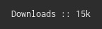

# Scieldas

[Scieldas](https://scieldas.autophagy.io) is a service to provide metadata badges for open source project
READMEs, inspired by [Shields.io](https://shields.io). It currently supports:

  - **Read The Docs** :: Build status of the Latest tag.
  - **Travis CI** :: Build status of the last build.
  - **PyPI** :: Version of project and supported python versions.
  - **Docker Hub** :: Status of the latest build.
  - **Licenses** :: The license of the project.
  - **Styles** :: The autoformatted code style of the project.

Built with Flask and Docker.

## Running Scieldas

Running the Scieldas service requires [Docker](https://www.docker.com). You can either build
it yourself:

    $ docker build -t "autophagy:scieldas" .
    $ docker run -d --name=scieldas -p 80:8080 --env TRAVIS_API_KEY=key autophagy:scieldas

Or pull the image from [Docker Hub](https://hub.docker.com/r/autophagy/scieldas/) :

    $ docker pull autophagy/scieldas
    $ docker run -d --name=scieldas -p 80:8080 --env TRAVIS_API_KEY=key autophagy/scieldas

For more detailed information, including reqiured API keys, please see
the [documentation](https://scieldas.readthedocs.io/en/latest/).

## Supported Badges

### Travis CI

### Read The Docs

### Coveralls

### PyPI

#### Version

#### Python Versions

### PePy Downloads

### Docker Hub

### Licenses

### Code Styles

