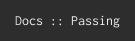
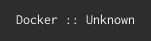
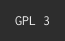

========
Scieldas
========

.. image:: http://scieldas.autophagy.io/rtd/scieldas.png
    :target: http://scieldas.readthedocs.io/en/latest
    :alt: Documentation Status

.. image:: http://scieldas.autophagy.io/dockerhub/build/autophagy/scieldas.png
   :target: https://hub.docker.com/r/autophagy/scieldas/
   :alt: Docker Build Status

.. image:: http://scieldas.autophagy.io/licenses/MIT.png
   :target: LICENSE
   :alt: MIT License

Scieldas is a service to provide metadata badges for open source project READMEs,
inspired by `Shields.io`_. It currently supports:

- **Read The Docs** :: Build status of the Latest tag.
- **Travis CI** :: Build status of the last build.
- **PyPI** :: Version of project and supported python versions.
- **Docker Hub** :: Status of the latest build.

Built with Flask and Docker.

Running Scieldas
================

Running the Scieldas service requires `Docker`_. You can either build it
yourself::

    $ docker build -t "autophagy:scieldas" .
    $ docker run -d --name=scieldas -p 80:8080 --env TRAVIS_API_KEY=key autophagy:scieldas

Or pull the image from `Docker Hub`_ ::

    $ docker pull autophagy/scieldas
    $ docker run -d --name=scieldas -p 80:8080 --env TRAVIS_API_KEY=key autophagy/scieldas

For more detailed information, including reqiured API keys, please see the
`documentation`_.

Supported Badges
================

Travis CI
~~~~~~~~~

.. image:: seonu/_static/travis/Build-Passing.png
    :target: _
    :alt: Travis Build Passing

.. image:: seonu/_static/travis/Build-Failing.png
    :target: _
    :alt: Travis Build Failing

.. image:: seonu/_static/travis/Build-Unknown.png
    :target: _
    :alt: Travis Build Unknown

Read The Docs
~~~~~~~~~~~~~

.. image:: seonu/_static/rtd/Docs-Failing.png
    :target: _
    :alt: Read The Docs Build Failing

.. image:: seonu/_static/rtd/Docs-Unknown.png
    :target: _
    :alt: Read The Docs Build Unknown

PyPI
~~~~

Version
.......

.. image:: seonu/_static/pypi/Pypi-Version.png
    :target: _
    :alt: PyPI Version

Python Versions
...............

.. image:: seonu/_static/pypi/Python-Versions.png
    :target: _
    :alt: Python Versions

Docker Hub
~~~~~~~~~~

.. image:: seonu/_static/dockerhub/Build-Passing.png
    :target: _
    :alt: Docker Build Passing

.. image:: seonu/_static/dockerhub/Build-Failing.png
    :target: _
    :alt: Docker Build Failing

.. image:: seonu/_static/dockerhub/Build-Building.png
    :target: _
    :alt: Docker Build Building

Licenses
~~~~~~~~

.. image:: seonu/_static/licenses/Apache.png
    :target: _
    :alt: Apache 2.0 license

.. image:: seonu/_static/licenses/MIT.png
    :target: _
    :alt: MIT license

.. _Shields.io: https://shields.io
.. _Docker: https://www.docker.com
.. _Docker Hub: https://hub.docker.com/r/autophagy/scieldas/
.. _documentation: https://scieldas.readthedocs.io/en/latest/
