========
Scieldas
========

Badges for software projects. Aiming to initially support Travis, RTD, PyPi
(version and pyversions) and licenses (Apache, GPL, MIT).

Built with Flask and Docker, probably. `Specification`_.

Read The Docs
=============

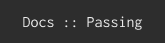

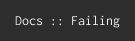

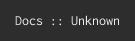

Travis
======

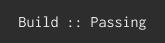

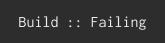

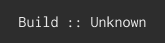

PyPi
====

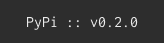

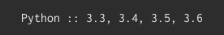

licenses
========

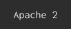

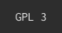

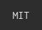

.. _Specification: spec/spec.rst
