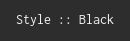
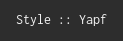
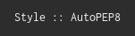

Detailed Information
====================

Supported Image Types
---------------------

The Scieldas service exposes 2 endpoints for each badge - a ``.svg`` and a
``.png``. It is advisable to use the png endpoint for when you cannot guarantee
that the `Inconsolata`_ font will be available, like on Github, as the svg
buttons will not render correctly otherwise. For example::

    scieldas-service/travis/Autophagy/scieldas.svg

Will return the .svg file, whereas::

    scieldas-service/travis/Autophagy/scieldas.png

Will return the .png equivalent.

Supported Metadata Services
---------------------------

Travis CI
~~~~~~~~~

Endpoint: ``/travis/<user>/<repo>.svg``

.. image:: ../_static/travis/Build-Passing.png
    :target: _
    :alt: Travis Build Passing

.. image:: ../_static/travis/Build-Failing.png
    :target: _
    :alt: Travis Build Failing

.. image:: ../_static/travis/Build-Unknown.png
    :target: _
    :alt: Travis Build Unknown

Read The Docs
~~~~~~~~~~~~~

Endpoint: ``/rtd/<project>.svg``

.. image:: ../_static/rtd/Docs-Passing.png
    :target: _
    :alt: Read The Docs Build Passing

.. image:: ../_static/rtd/Docs-Failing.png
    :target: _
    :alt: Read The Docs Build Failing

.. image:: ../_static/rtd/Docs-Unknown.png
    :target: _
    :alt: Read The Docs Build Unknown

PyPI
~~~~

Version
.......

Endpoint: ``/pypi/version/<project>.svg``

.. image:: ../_static/pypi/Pypi-Version.png
    :target: _
    :alt: PyPI Version

Python Versions
...............

Endpoint: ``/pypi/pyversions/<project>.svg``

.. image:: ../_static/pypi/Python-Versions.png
    :target: _
    :alt: Python Versions

Docker Hub
~~~~~~~~~~

Endpoint: ``/dockerhub/build/<user>/<repo>.svg``

.. image:: ../_static/dockerhub/Build-Passing.png
    :target: _
    :alt: Docker Build Passing

.. image:: ../_static/dockerhub/Build-Failing.png
    :target: _
    :alt: Docker Build Failing

.. image:: ../_static/dockerhub/Build-Building.png
    :target: _
    :alt: Docker Build Building

.. image:: ../_static/dockerhub/Build-Unknown.png
    :target: _
    :alt: Docker Build Unknown

Licenses
~~~~~~~~

Endpoint: ``/licenses/<license>.svg``

Valid licenses are **Apache**, **GPL**, and **MIT**.

.. image:: ../_static/licenses/Apache.png
    :target: _
    :alt: Apache 2.0 license

.. image:: ../_static/licenses/GPL.png
    :target: _
    :alt: GPL license

.. image:: ../_static/licenses/MIT.png
    :target: _
    :alt: MIT license

Code Styles
~~~~~~~~~~~

Endpoint: ``/styles/<style>.svg``

Valid styles are **black**, **yapf** and **autopep8**.

.. _Inconsolata: https://fonts.google.com/specimen/Inconsolata
